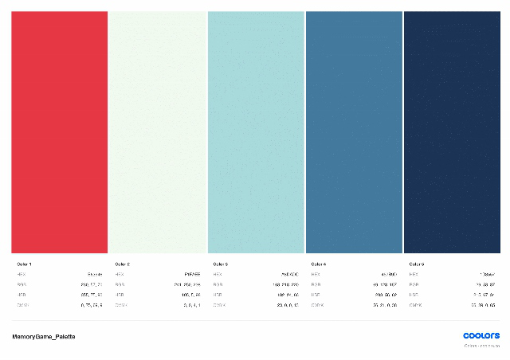
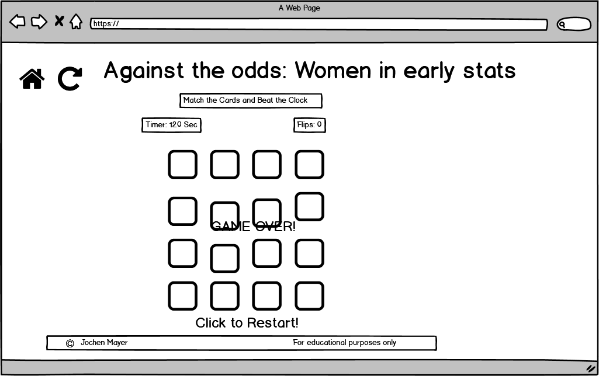
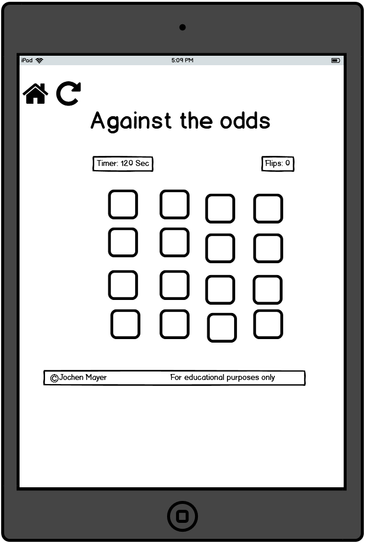
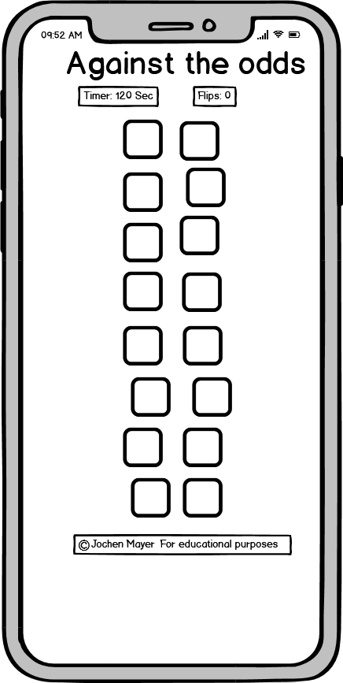

# Against the Odds: Women Trailblazers in Statistics #

## 1. Overview ##

This memory game was planned and coded with my daughters and every other girl (and boy!) in mind. Statistical sciences, like many other disciplines in Science, Technology, 
Engineering and Mathematics (STEM) are still very much male dominated and I wanted to show that success and great performances are possible for women by designing this game around eight
women who were trailblazers and outstanding contributors to Statistics. All of them succeeded at a time when the profession was even more unfavourable for female - or indeed any other under-represented - voices 
than it is today. They all blazed the way despite the considerable odds against them - hence my title.

It has been created for entertainment and educational purposes for all ages from 7 onwards. Using images from the public domain as card faces, the game allows players to match two 
cards of the same character image in pairs before the timer reaches zero. 

## 2. UX ##

### 2.1. User Stories

The game is designed for all age groups but in terms of difficulty level targets children between 6-14 years of age primarily. 
I expect different user groups to have the following expectations when they come to the site:

- As a general user, I would like to enjoy a simple memory card game with a visually appealing format and uplifting music.
- As a general user, I would enjoy learning something meaningful while playing a game. 
- As a general user, I would like to play a game that does not take too long but posits a small challenge.
- As a general user, I would like to be able to track my progress.
- As a general user, I would like to practice my memory skills.
- As a general user, I would like to enjoy a simple memory game that provides a 'reward' for completion and let's me learn something.

As a child (age 6-14), I would like to:

- easily navigate around the game and understand all commands and messages.
- play a game that is inuitive.
- play a game that is fun and looks nice.
- play a game that rewards me for winning.

As a parent, I would like my child to:

- play a game which is safe to use in terms of content.
- play a game that is sufficiently challenging without causing frustration due to too great a level of difficulty.
- play a game which enhances their memory skills.
- play a game that teaches something about the world. 

### 2.2 Design Process

*Colour Palette*

Color composition was inspired by this 1980 picture of Margaret Martin (left) and Helen Walker (who is included in the memory game). 

On [Coolors](https://coolors.co/) I was able to add matching colors to the above and create the following palette which is used throughout this project:

The red (#E63946) is obviously different from the above of Martin's outfit but its bright, almost shouty tone served well to symbolize the breakthrough these women had achieved in a 
blue (male) dominated environment. Overall, I felt these colors complemented each other well and were fun, bright and vibrant in keeping with the aesthetic I was aiming for, and which 
is also reflected in the jolly background music.

*Icons*

For the back of the cards, I chose two icons which represent the topic as best as possible, I think: the gender symbol for female and the 'bell curve', a visualisation of the 
normal distribution for a variable. The term 'bell curve' originates from the fact that the graph used to depict a normal distribution consists of a symmetrical bell-shaped curve. 
Since both icons represent the respective field this game is about - women and statistics - in a common and popular way, I felt they should go on the back of the cards.

*Typography*

I chose Syne Mono for the entire project because I liked the aesthetic and thought that the way its creators [described](https://www.1001fonts.com/syne-font.html) it 
as giving the "type's contours a unique treatment, mixing arcs and straight lines in a completely unorthodox and vivacious way...\[integrating\] a desired lost \[sic!\] of control, 
an aceptance of error..." speaks to the topic of this game which is 'against the odds', breakthrough, change, and difference.

*Animations*

I added animations on hover on the back of the cards to alert the user that these can be clicked. The change of size of the cards on click simulates the grasping of a card jusst before 
it is flipped. The shadows on hover behind the portrait images is just a nice addition to make it a little more 3D.

*Sound*

I loved the idea of a game with sounds and feel the background music conveys a happy and fun atmosphere for playing the game while also pushing the user to finish in time as the beat is exactly in tune
with the decrementing seconds. The flip sound for the cards adds a real-world experience of playing cards for the user, while the hand bells on matching is a nice addition to alert the user
to his/her success. The victory fanfare constitutes a neat yet solemn break with the background music, while the Tom & Jerry-like game over-sound really drives the message home 
to the user: you are out.

*Wireframes*

I used Balsamiq to create three wireframes, for desktop, tablet, and mobile:

As can be seen, the 'game over' overlay was added for the desktop view whilst the 'click to start' as well as the 'victory' and 'prize' overlays were sketched out 
as a comment in the original Balsamiq wireframe. The prize page (prize.html) was added after I realized that a portrait gallery of all eight protagonists would be 
more informative and appealing to the user than a 'prize' overlay with a link to just one or two statisticians as I had originally planned.

## 3. Features ##

### 3.1. Existing Features ###

*index.html*

- [x] **Game titles**: identify the topic and the type of game with brief game instructions.
- [x] **Click to Start overlay**: starts the game, timer and background music as and when the player is ready.
- [x] **Footer**: contains basic copyright information.
- [x] **Mute button**: allows player to mute/unmute music in case his/her game is interrupted by another activity which briefly requires attention.
- [x] **Pause button**: allows the player to pause/resume the game in case his/her game is interrupted by another activity which requires full attention.
- [x] **Flip counter**: counts the number of flips a user has made, allowing them to track their progress and compete for the lowest number of flips.
- [x] **Timer**: displays the time remaining for the user to complete the game.
- [x] **Game board**: displays the game cards face down ready to be clicked.
- [x] **Game cards**: interactive on hover on the card back, their card face contains the portrait images to be matched by the user to win the game. Upon match, the name of the 
matched statisticians appears.

*sounds*

- [x] **Background music**: starts with click to start and ends with either 'victory' or 'game over'. 
- [x] **card flip**: triggered with every card flip and sounds as if a game card is manually flipped.
- [x] **Game over**: triggered when timer runs out before the cards have been matched.
- [x] **Victory**: triggered when all cards are matched before the clock runs down to 0.

*win/lose overlays*

- [x] **Victory overlay**: triggered when the user wins the game by finding all the matching cards within the alloted time. Winner can click on a button to be redirected to prize.html.
- [x] **Game Over overlay**: triggered when user loses the race against the clock. User can click on button to restart another game.

*prize.html*
- [x] **Prize title**: gives user the option to learn more about the eight women trailblazers or click a button to restart the game rightaway.
- [x] **Portrait gallery**: contains the same images as on the memory cards but with information on name, date of birth/death and a brief image caption with the possibility to click on 
a link for further information about the respective person.
- [x] **Footer**: contains basic copyright information.

### 3.2. Features Left to Implement 

- [ ] Add difficulty levels for the user to choose from (easy, medium, hard) with more cards and/or less time to complete the game. 
- [ ] Star rating (from 1–3) that reflects the player’s performance based on number of moves made.
- [ ] Add modal or HTML elements to 'Victory overlay' to show user how much time he/she took, and star rating.
- [ ] The animated image overlay which is currently onmouseover in JS was originally planned as part of the cardMatch(card1, card2) function. I had started to read up on the data-*attributes
with which I planned to target the overlay, but I found this too difficult to implement, especially because sixteen cards needed to be matched intp pairs and thus animated, and the imagecaption overlay
needed to be undone after every game over or victory.

## 4. Technologies Used

* The wireframes for this project were drawn up with [Balsamiq](https://balsamiq.com/)

* The Syne mono font is drawn from [Google Font](https://fonts.google.com/).

* [Coolors](https://coolors.co/) was used to generate the color palette.

* The Favicons have been created with [Favicon](https://favicon.io/).

Cursor

* ...was inspired by code from [Stackoverflow](https://stackoverflow.com/)    

* Code for shadows behind portrait images on prize.html is taken from [Codepen](https://codepen.io/)

*  [GitHub](https://github.com) and [Gitpod](https://www.gitpod.io/) were used to host the software development versions and to create and save the code respectively.

* [Chrome DevTools](https://developers.google.com/web/tools/chrome-devtools) built directly into the Google Chrome browser were used constantly thoughout the development cycle to test responsive design 
and diagnose problems.

* I used [W3C Markup Validation Service](https://validator.w3.org/) for both HTML and CSS to run my code looking for errors.

* [Jshint](https://jshint.com/) to validate my JavaScript code 

* [Lighthouse](https://developers.google.com/web/tools/lighthouse) to test the performance of the website.

* [AmiResponsiveDesign](http://ami.responsivedesign.is) to test responsive design on various devices.

* Portrait images were sourced from wikipedia.

* Bell curve on back of the cards was purchased from [TheNounProject](https://thenounproject.com/).

* All sounds were acquired from this [repository](http://dight310.byu.edu/media/audio/FreeLoops.com/2/) and from [freesound](https://freesound.org/home/).

## 5. Testing

### 5.1 Automatic Testing

Automated and manual testing were conducted during this project. 

1. I used the [W3C CSS Validator](https://jigsaw.w3.org/css-validator/) and the [W3C HTML Validator](https://validator.w3.org/) which returned "Congratulations! No Error Found"
 "Document checking completed. No errors or warnings to show" respectively.

2. I used [AmiResponsiveDesign](.http://ami.responsivedesign.is) to create the following test result: 

- insert PNG

As can be seen, all pages, links, icons performed as expected on all devices (with the exception of the hero image on the iPhone)

3. JShint

- insert metrics here as screenshot

Lighthouse was used to test the performance of the application on both pages (index.html and prize.html) on mobile and desktop.

The following reports were generated: - add via uploading screenshots on igur, or by adding them to the files

*index.html - Desktop:*

- Please click the links below to view the reports:

    - [Performance]() report
    - [Accessibility]() report
    - [Best practices & SEO]() report

*prize.html - Desktop:*

*index.html - Mobile:*    

*prize.html - Mobile:*

### 5.2 Manual Testing

The application was tested across Google Chrome, Firefox, Microsoft Edge, Explorer and Safari browsers to ensure everything worked as it should and to identify issues/bugs.

Developer tools in Chrome were also used during the creation phases for the various viewport sizes.

Here are some of the 

*Game Functionality*

I played the game repeatedly to test functionality and invited the entire family and some of my friends to play and test. The game has thus been played by user aged between 6 and 64.
Collectively, it was shown that:

- game is winable within the alotted time for young and old, 
- timer and background music starts when Click to Start overlay is clicked,
- matched pairs are disabled and cannt be clicked again,
- if pairs are matched, bell sound is triggered (although intermittently only),
- repeated clicks on matching pairs does not effect click counter and matched cards are only counted as one match,
- time running out before all pairs are found triggers Game Over Overlay and Game Over Sound,
- matching pairs stay face up,
- cards stay face-up long enough for user to see images,
- flipped cards that are not a match return to default position face-down,
- all pairs found within alotted time triggers Victory Overlay and Sound,
- timer stops when game is won,
- user can proceed via Victory overlay to prize.html,
- from prize.html user can click back to restart the game.

Now we can come back to some of the user stories mentioned above (2.1) to see how the requirements have been met:

- "As a general user, I would like to enjoy a simple memory card game with a visually appealing format and uplifting music."
    - The color palette as well as several hover-over features and sound animations, combined with a meaningful content, make this a fun game to play.
- "As a general user, I would enjoy learning something meaningful while playing a game." 
    - The game contains images of hitherto under-represented female statisticians who had a significant impact on the field of statistics and beyond.
- "As a general user, I would like to be able to track my progress."
    - The timer and flip counter allow users to track their progress throughout the game.
- "As a general user, I would like to practice my memory skills."
    - Playing a card matching game can help improve memory skills.
- "As a general user, I would like to enjoy a simple memory game that provides a 'reward' for completion and let's me learn something."
    - The game does not just end on 'Victory' but provides a prize site with useful further information on the topic for anybody who would like to know more.

As a child (age 6-14), I would like to:

- "easily navigate around the game and understand all commands and messages."
    - Navigation through this game is clearly defined through colours, buttons, and other layout features.
- "play a game that is fun and looks nice."
    - Bright, vibrant colours, interesting images of female characters, music, and animations make this a fun game to play whilst the running clock 
        adds a bit of thrill and challenge 

As a parent, I would like my child to:

- "play a game which is safe to use in terms of content."
    - All content is safe to use and highly interesting, especially for older children and adults with an interest in science and gender.
- "play a game that is sufficiently challenging without causing frustration due to too great a level of difficulty."
    - The amount of cards and the race against the cloclk add difficulty to the game, whilst training memory and visual skills.
- "play a game that teaches something about the world." 
    - Anybody who cares to read on (on prize.html) about these outstanding women will notice that they all have been mentors and inspirations to generations of statisticians - both male and emale - and are 
    role models for us today.

### 5.3 Bugs and Solutions

1. Resolved Bugs

*Browser Testing*

In Safari and Firefox, the time ran twice as fast taking away two digits every second from the timer and it would run into negative time (below zero) after 'Game Over'. 

Additionally, in Safari, all cards were shown card face up (visible) by default, and in MS Edge the game would start with the wrong overlay visible. 
Music would not start playing in neither of them.

All of these issues except the music issue, were resolved by moving the 
from the header of the HTML pages to below the footer inside the body tag.

In MS Explorer, game would not even start and all cards were aligned in one single row.

In the coding process, I encountered a number of minor bugs such as absent 
or inconsistent camelCases, or capital letters at the beginning of a variable. I also had commented out vital functions for testing reasons, such as game.StartGame(), 
and forgot to uncomment them until I noticed.  
Also, when coding the play/pause and un/mute functions, I initially did not insert the corresponding methods in my  
muteMusic() {
        bgMusic.mute();
pauseMusic() {
        bgMusic.pause();
    }

in my AudioController class 

Always use the "new" keyword whenever you want to use a method within a class

Here are some of the more substantial bugs I encountered and my approach to fix them:

- 

getCardType(card) {
        return card.getElementsByClassName('card-value')[0].src; //gets the card in HTML by the class indicated, as it is only one, it is 0 (=zero-index), 
                                                                //and then the source attribute

added startGame function, added empty matchedCards array and three options when user is not allowed to flip another card which is a Boolean, 
but spelled outin super complicated, negative way, and added flipCard function but nothing work
- canFlipCard(card) {
        return true;
        //return !this.busy && !this.matchedCards.includes(card) && card !== this.cardToCheck;

This function is meant to check the conditions under which cards must not be flipped, and there are three of them. The first is that card must not be flipped if this.busy which might represent
an animation or anything like that and user is not allowed to click on anything until this is finished. The second is an unallowed click on cards that are already matched and lay face-up and
a further click would run the flipCard function. The third case is an unallowed click on a card that is already flipped waiting face up to be matched.
Solution was taken from [PortEXE](https://www.youtube.com/watch?v=3uuQ3g92oPQ&t=1259s) min 21:00

So all three are negative statements will have to be fulfilled and the function returns 'true'.

The shuffle algorithm is based on pseudo-code...and also explained well here by Marina [Ferreira](https://www.youtube.com/watch?v=ZniVgo8U7ek&t=681s) (from 31:07 min) 
although slightly different as shuffle() is wrapped inside an extra pair of parenthesis which makes it into a 
IIFE=Immediately Invoked Function Expression which means that function will be executed right after its definition. 

2. Persisting bugs

- bell sound when cards matched sounds irregularly;
- customized cursors (female scientist and female icon) do not load and cursor image does not change on hovering over areas.
- Some images of the portrait gallery on prize.html are of different sizes.
- Music OK?

## 6. Deployment

1. I created a Github account under [JochenFM](https://github.com/JochenFM)

2. I committed and pushed all files for this project to my Github repistory [Milestone2](https://github.com/JochenFM/Milestone_2)

3. To make my website live and working for other people to look at, I followed the 
steps outlined [here](https://docs.github.com/en/github/working-with-github-pages/configuring-a-publishing-source-for-your-github-pages-site): 
In my repository, I went to 'Settings', then scrolled down to 'Github Pages'. 
Under the Source setting, I used the drop-down menu to select 'master branch' as a publishing source and saved it. 
Upon refreshing the github page, I was issued the url where my page is published, namely "Your site is published at https://jochenfm.github.io/Milestone_2/"

To pull my code from my Github repository to run it on another machine, one would go to my [repository](https://github.com/JochenFM/Milestone_2) and on the 
main page one would then click the green button 'Code' with a downward pointing arrow, on the right hand side just above the files. This button will give 
options to 'clone with HTTPS', or 'Open with Github Desktop', or 'Download ZIP'. 

To continue with cloning, one would then:

* open Git Bash,
* change the current working directory to the location where one wants the cloned directory to be made,
* type 'git clone', and then paste this URL; https://github.com/JochenFM/Milestone_2 
* press 'Enter' to create the local clone.

See also [here](https://docs.github.com/en/github/creating-cloning-and-archiving-repositories/cloning-a-repository) for more information on the process.

## 7. Credits

### 7.1. Content

All text for this project was written by the developer.

### 7.2. Media

### 7.3. Ackowledgments

Memory game tutorials on the web, especially by [WebDevSimplified](https://www.youtube.com/channel/UCFbNIlppjAuEX4znoulh0Cw) 
and [PortEXE](https://www.youtube.com/channel/UCFbNIlppjAuEX4znoulh0Cw) were a tremendous help. PortEXE does a great job explaining the Fisher-Yates algorithm, for instance, as well as a number of 
other  

I was further inspired by Sandra [Israel-Ovirih's](https://scotch.io/tutorials/how-to-build-a-memory-matching-game-in-javascript) and Marina [Ferreira's](https://www.youtube.com/watch?v=ZniVgo8U7ek&t=681s) 
tutorials which provided helpful explanations.

Page redirect between index.html and prize.html in JS was taken from [tutorialrepublic](https://www.tutorialrepublic.com/faq/how-to-redirect-to-another-web-page-using-jquery.php) and edited to suit my needs.

Centering the mute and play buttons horizontally and vertically is inspired by [w3schools](https://www.w3schools.com/howto/howto_css_center_button.asp), whilst the JS for both buttons to function
properly was inspired by Adam Khoury's [tutorial](https://www.youtube.com/watch?v=hsSXzdn_0Gg) and edited to fit my code.

The idea for active card on click is from Marina [Ferreira](https://www.youtube.com/watch?v=ZniVgo8U7ek&t=681s) (from 11:33min)

Animated image overlay on matched cards was inspired by [cssscript](https://www.cssscript.com/animated-image-hover-overlay-with-image-scale/) and edited to suit my needs. 

Thanks also to tutors Samantha Dartnell, Johann Alberts, and Michael Park for going with me through the play/pause and un/mute functions and buttons, and to my fellow students on Slack,
especially those who also coded memory games in the past.

A special thank to my mentor [Adegbenga Adeye](https://github.com/deye9) for commenting on earlier versions of my code and especially for going through some tricky JS issues with me.

