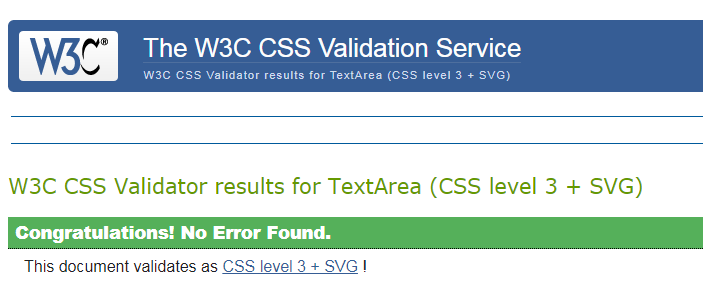
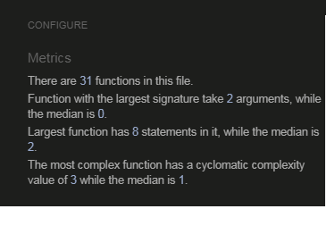

# Against the Odds: Women Trailblazers in Statistics #

## 1. Overview ##

This memory game was planned and coded with my daughters and every other girl (and boy!) in mind. Statistical sciences, like many other disciplines in Science, Technology, 
Engineering and Mathematics (STEM) are still very much male dominated and I wanted to show that success and great performances are possible for women by designing this game around eight
women who were trailblazers and outstanding contributors to Statistics. All of them succeeded at a time when the profession was even more unfavourable for female - or indeed any other under-represented - voices 
than it is today. They all blazed the way despite the considerable odds against them - hence my title.

It has been created for entertainment and educational purposes for all ages from six onwards. Using images from the public domain as card faces, the game allows players to match two 
cards of the same character image in pairs (and eight pairs in total) before the timer reaches zero. If the user wins against the clock, s/he will be redirected (on click) to a prize page: an image gallery
comprising portrait, name, date of birth, and brief caption with biographical information - with opportunity to click on link for further information - for each of the eight statisticians. 

## 2. UX ##

### 2.1. User Stories

The game is designed for all age groups but in terms of difficulty level targets children between 6-14 years of age primarily. 
I expect different user groups to have the following expectations when they come to the site:

As a general user, I would like to: 

- enjoy a simple memory card game with a visually appealing format and uplifting music.
- enjoy learning something meaningful while playing a game. 
- play a game that does not take too long but posits a small challenge.
- be able to track my progress.
- practice my memory skills.
- enjoy a simple memory game that provides a 'reward' for completion and let's me learn something.

As a child (age 6-14), I would like to:

- easily navigate around the game and understand all commands and messages.
- play a game that is inuitive.
- play a game that is fun and looks nice.
- play a game that rewards me for winning.

As a parent, I would like my child to:

- play a game which is safe to use in terms of content.
- play a game that is sufficiently challenging without causing frustration due to too great a level of difficulty.
- play a game which enhances their memory skills.
- play a game that teaches something about the world. 

### 2.2 Design Process

*Colour Palette*

Color composition was inspired by this 1980 picture of two statisticians - Margaret Martin (left) and Helen Walker (who is included in the memory game). 

On [Coolors](https://coolors.co/) I was able to add matching colors to the above and create the following palette which is used throughout this project:

The red (#E63946) is obviously different from the above of Martin's outfit but its bright, almost shouty tone served well to symbolize the breakthrough these women had achieved in a 
blue (male) dominated environment. Overall, I felt these colors complemented each other well and were fun, bright and vibrant in keeping with the aesthetic I was aiming for, and which 
is also reflected in the jolly background music.

*Icons*

For the back of the cards, I chose two icons which represent the topic as best as possible: the gender symbol for female and the 'bell curve', a visualisation of the 
normal distribution for a variable. The term 'bell curve' originates from the fact that the graph used to depict a normal distribution consists of a symmetrical bell-shaped curve. 
Since both icons represent the respective field this game is about - women and statistics - in a common and popular way, I felt they should go on the back of the cards.
Cursor icon...

*Typography*

I chose Syne Mono for the entire project because I liked the aesthetic and thought that the way its creators [described](https://www.1001fonts.com/syne-font.html) it 
as giving the "type's contours a unique treatment, mixing arcs and straight lines in a completely unorthodox and vivacious way...\[integrating\] a desired lost \[sic!\] of control, 
an aceptance of error..." speaks to the topic of this game which is 'against the odds', breakthrough, change, and difference.

*Animations*

I added animations on hover on the back of the cards to alert the user that these can be clicked. The change of size of the cards on click simulates the grasping of a card just before 
it is flipped. The shadows on hover behind the portrait images on prize.html is just a nice addition to make it a little more 3D.

*Sound*

I loved the idea of a game with sounds and feel the background music conveys a happy and fun atmosphere for playing the game while also pushing the user to finish in time as the beat is exactly in tune
with the decrementing seconds. The flip sound for the cards adds a real-world experience of playing cards for the user, while the hand bells on matching is a nice addition to alert the user
to his/her success. The victory fanfare constitutes a neat yet solemn break with the background music, while the Tom & Jerry-like game-over sound really drives the message home 
to the user: you are out.

*Wireframes*

I used Balsamiq to create three wireframes, for desktop, tablet, and mobile:

As can be seen, the 'game over' overlay was added for the desktop view whilst the 'click to start' as well as the 'victory' and 'prize' overlays were sketched out 
as a comment in the original Balsamiq wireframe. The prize page (prize.html) was added after I realized that a portrait gallery of all eight protagonists would be 
more informative and appealing to the user than a 'prize' overlay with a link to just one or two statisticians, as I had originally planned.

## 3. Features ##

### 3.1. Existing Features ###

*index.html*

- [x] **Game titles**: identify the topic and the type of game with brief game instructions.
- [x] **Click to Start overlay**: starts the game, timer and background music as and when the player is ready.
- [x] **Footer**: contains basic copyright information.
- [x] **Flip counter**: counts the number of flips a user has made, allowing them to track their progress and compete for the lowest number of flips.
- [x] **Timer**: displays the time remaining for the user to complete the game.
- [x] **Game board**: displays the game cards face down ready to be clicked.
- [x] **Game cards**: interactive on hover on the card back, their card face contains the portrait images to be matched by the user to win the game. Upon match, the name of the 
matched statisticians appears.

*sounds*

- [x] **Background music**: starts with click to start and ends with either 'victory' or 'game over'. 
- [x] **card flip**: triggered with every card flip and sounds as if a game card is manually flipped.
- [x] **Game over**: triggered when timer runs out before the cards have been matched.
- [x] **Victory**: triggered when all cards are matched before the clock runs down to 0.

*win/lose overlays*

- [x] **Victory overlay**: triggered when the user wins the game by finding all the matching cards within the alloted time. Winner can click on a button to be redirected to prize.html.
- [x] **Game Over overlay**: triggered when user loses the race against the clock. User can click on button to restart another game.

*prize.html*
- [x] **Prize title**: gives user the option to learn more about the eight women trailblazers or click a button to restart the game rightaway.
- [x] **Portrait gallery**: contains the same images as on the memory cards but with information on name, date of birth/death and a brief image caption with the possibility to click on 
a link for further information about the respective person.
- [x] **Footer**: contains basic copyright information.

### 3.2. Features Left to Implement 

- [ ] Add difficulty levels for the user to choose from (easy, medium, hard) with more cards and/or less time to complete the game. 
- [ ] Star rating (from 1–3) that reflects the player’s performance based on number of moves made.
- [ ] Add modal or HTML elements to 'Victory overlay' to show user how much time he/she took, and star rating.
- [ ] The animated image overlay which is currently onmouseover in JS was originally planned as part of the cardMatch(card1, card2) function. I had started to read up on the data-*attributes
with which I planned to target the overlay, but I found this too difficult to implement within the time at hand, especially because sixteen cards needed to be matched into pairs and thus animated, and the imagecaption overlay
needed to be undone after every game over or victory.
- [ ] Make mute button functional via JS which will allow player to mute/unmute music in case his/her game is interrupted by another activity which briefly requires attention.
- [ ] Make pause button functional for the player to pause/resume the music in case his/her game is interrupted by another activity which requires full attention. 

## 4. Technologies Used

* The wireframes for this project were drawn up with [Balsamiq](https://balsamiq.com/)

* The Syne mono font is drawn from [Google Font](https://fonts.google.com/).

* [Coolors](https://coolors.co/) was used to generate the color palette.

* The Favicons have been created with [Favicon](https://favicon.io/).

* Custom cursor icon is from [RealWorld Graphics](http://www.rw-designer.com/).

* Code for shadows behind portrait images on prize.html is taken from [Codepen](https://codepen.io/).

* [GitHub](https://github.com) and [Gitpod](https://www.gitpod.io/) were used to host the software development versions and to create and save the code respectively.

* [Chrome DevTools](https://developers.google.com/web/tools/chrome-devtools) built directly into the Google Chrome browser were used constantly thoughout the development cycle to test responsive design 
and diagnose problems.

* I used [W3C Markup Validation Service](https://validator.w3.org/) for both HTML and CSS to run my code looking for errors.

* [Jshint](https://jshint.com/) to validate my JavaScript code.

* [Lighthouse](https://developers.google.com/web/tools/lighthouse) to test the performance of the website.

* [AmiResponsiveDesign](http://ami.responsivedesign.is) to test responsive design on various devices.

*  Mute/unmute and play/pause icons, as well as bell curve on back of the cards was purchased from [TheNounProject](https://thenounproject.com/).

* [Imgur](https://imgur.com/) to store external images for README.md

## 5. Testing

### 5.1 Automatic Testing

Automated and manual testing were conducted during this project. 

1. I used the [W3C CSS Validator](https://jigsaw.w3.org/css-validator/) and the [W3C HTML Validator](https://validator.w3.org/) which respectively
returned:

and "Document checking completed. No errors or warnings to show" for both html pages.

2. I used [AmiResponsiveDesign](.http://ami.responsivedesign.is) to create this [test result](https://imgur.com/kCF7iEN) for index.html.

As can be seen, all pages, overlays, and icons performed as expected on all devices (with the exception of the start overlay on mobile phone).

The application is also responsive in [mobile phone size](https://imgur.com/fw7nDzT).

_prize.html_

This page cannot be accessed via URL so testing via software is not possible, but the following screenshots prove media responsivness:

At [1000px width](https://imgur.com/RVljmAJ)

At [ipad size](https://imgur.com/lZQMfY8)

At [mobile phone size](https://imgur.com/hGCjWeX)

3. JShint was used to validate JS

- no major errors found, as can be seen from result:

Lighthouse was used to test the performance of the application on both pages (index.html and prize.html) on mobile and desktop.

The following reports were generated:

*index.html - Desktop:*

1. SEO Report indicated: 

"Does not have a _meta name="viewport"_ tag with width or initial-scale" 

- I added that in the _head_ elements.

"Document does not have a meta description" 

- I added _meta name="Description" content=""_ providing a summary of the page content. 

2. Accessibility Report stated:

"Heading elements are not in a sequentially-descending order" 

- I replaced "h4" in the footer with a "h3" to avoid anti-pattern and use a correctly sequenced heading structure from h1-h3 instead.

"Buttons do not have an accessible name". Issue refers to button#soundToggler.btn.soundOn and button#playToggler.btn.gameOn.

- I tried to address this issue by changing the id to soundbtn and playbtn but issue persists. I will rectify it when I come back to the entire sound control issue at a later stage.

3. Best Practices Report said:

"Displays images with incorrect aspect ratio" which concerns some of the portrait images and especially the female icons on back of cards. 
- I lost points here and will probably have to insert an image CDN at a later stage to rectify.

"Charset declaration is missing or occurs too late in the HTML"

- I moved the _meta charset="UTF-8"_ element right after the _head_ element.

Lighthouse report is now as [follows](https://imgur.com/UMq6nNz) 

*prize.html - Desktop:*

Generally, as prize.html page can currently only be opened via the victory overlay on index.html, Lighthouse indicated that: 
"There were issues affecting this run of Lighthouse: Chrome extensions negatively affected this page's load performance. 
Try auditing the page in incognito mode or from a Chrome profile without extensions."

1. Best Practice Report indicated that:

"Links to cross-origin destinations are unsafe"

- I added rel="noopener" to all eight links to meet requirements of cross-origin destination audit.

"Charset declaration is missing or occurs too late in the HTML"

- I moved the _meta charset="UTF-8"_ element right after the _head_ element.

2. Performance Report said that:

"Image elements do not have explicit width and height
Set an explicit width and height on image elements to reduce layout shifts and improve CLS."

- I addressed this issue by manually reiszing all images using free and open-access [Picresize](https://picresize.com/) software as I have a responsive grid which would not allow 
    specific image dimensions. But the issue persisted and I lost points here as even although images now are all same height and width, this was not achieved via 
    setting an explicit height and width on image elements in CSS.  

2. SEO Report flagged out that:

"Does not have a _meta name="viewport"_ tag with width or initial-scale" 

- I added that in the _head_ elements.

"Document does not have a meta description" 

- I added _meta name="Description" content=""_ providing a summary of the page content. 

"Links do not have descriptive text" 

- I changed clickable link text from 'here' to more descriptive language for both users and search engines to more easily understand content and how it relates to other pages. 

3. Accesibility Report stated:

"Heading elements are not in a sequentially-descending order" 

- I replaed "h4" in the footer with a "h3" to avoid anti-pattern and use a correctly sequenced heading structure from h1-h3 instead.

Lighthouse report is now as [follows](https://imgur.com/eZfwbgh) 

A few opportunities to improve Performance and Best Practices of both pages remain 
and will be addressed at a later stage:

* Performance of both pages:  

"Eliminate render-blocking resources"

"Serve images in next-gen formats"

"Image elements do not have explicit width and height"

* Best Practices in both pages:

"Browser errors were logged to the console" which concerns an issue with _link rel="manifest" href="/site.webmanifest"_ which I was unable to resolve.

### 5.2 Manual Testing

The application was tested across Google Chrome, Firefox, Microsoft Edge, Explorer and Safari browsers to ensure everything worked as it should and to identify issues/bugs.

Developer tools in Chrome were also used during the creation phases for the various viewport sizes.

Here are some of the 

*Game Functionality*

I played the game repeatedly to test functionality and invited the entire family and some of my friends to play and test. The game has thus been played by user aged between 6 and 64.
Collectively, it was shown that:

- game is winnable within the allotted time for young and old, 
- timer and background music starts when Click to Start overlay is clicked,
- matched pairs are disabled and cannt be clicked again,
- if pairs are matched, bell sound is triggered (although intermittently only),
- repeated clicks on matching pairs does not effect click counter and matched cards are only counted as one match,
- time running out before all pairs are found triggers Game Over Overlay and Game Over Sound,
- matching pairs stay face up,
- flipped card stays face-up and cannot be clicked again,
- cards stay face-up long enough for user to see images,
- flipped cards that are not a match return to default position face-down,
- all pairs found within allotted time triggers Victory Overlay and Sound,
- timer stops when game is won,
- user can proceed via Victory overlay to prize.html,
- from prize.html user can click back to restart the game.

Now we can come back to some of the user stories mentioned above (2.1) to see how the requirements have been met:

- "As a general user, I would like to enjoy a simple memory card game with a visually appealing format and uplifting music."
    - The color palette as well as several hover-over features and sound animations, combined with a meaningful content, make this a fun game to play.
- "As a general user, I would enjoy learning something meaningful while playing a game." 
    - The game contains images of hitherto under-represented female statisticians who had a significant impact on the field of statistics and beyond.
- "As a general user, I would like to be able to track my progress."
    - The timer and flip counter allow users to track their progress throughout the game, as can be seen [here](https://imgur.com/YgwUZ2Q)

- "As a general user, I would like to practice my memory skills."
    - Playing a card matching game can help improve memory skills.
- "As a general user, I would like to enjoy a simple memory game that provides a 'reward' for completion and let's me learn something."
    - The game does not just end on 'Victory' but provides a prize site with useful further information on the topic for anybody who would like to know more, as can be seen 
    [here](https://imgur.com/UE6ABMj) and below

As a child (age 6-14), I would like to:

- "easily navigate around the game and understand all commands and messages."
    - Navigation through this game is clearly defined through colours, buttons, and other layout features.
- "play a game that is fun and looks nice."
    - Bright, vibrant colours, interesting images of female characters, music, and animations make this a fun game to play whilst the running clock 
        adds a bit of thrill and challenge 

As a parent, I would like my child to:

- "play a game which is safe to use in terms of content."
    - All content is safe to use and highly interesting, especially for older children and adults with an interest in science and gender.
- "play a game that is sufficiently challenging without causing frustration due to too great a level of difficulty."
    - The amount of cards and the race against the clock add difficulty to the game, whilst training memory and visual skills.
- "play a game that teaches something about the world." 
    - Anybody who cares to read on (on [prize.html](https://imgur.com/S2FCUCd)) about these outstanding women will notice that they all have been mentors and inspirations to generations of statisticians - both male and female - and are 
    role models for us today.

### 5.3 Bugs and Solutions

1. Resolved Bugs

*Browser Testing*

In Safari and Firefox, the time ran twice as fast taking away two digits every second from the timer and it would run into negative time (below zero) after 'Game Over'. 

Additionally, in Safari, all cards were shown card face up (visible) by default, and in MS Edge the game would start with the wrong overlay visible. 
Music would not start playing in neither of them.

All of these issues except the music issue, were resolved by moving the _script src="assets/js/script.js" async></script_
from the header of the HTML pages to below the footer inside the body tag.

In MS Explorer, game would not even start and all cards were aligned in one single row.

In the coding process, I encountered a number of minor bugs such as absent 
or inconsistent camelCases, or capital letters at the beginning of a variable. I also had commented out vital functions for testing reasons, such as game.StartGame(), 
and forgot to uncomment them until I noticed. 

Also, when coding the play/pause and un/mute functions, I initially did not insert the corresponding methods in my  
muteMusic() {
        bgMusic.mute();
pauseMusic() {
        bgMusic.pause();
    }

in my AudioController class 

Always use the "new" keyword whenever you want to use a method within a class

Here are some of the more substantial bugs I encountered and my approach to fix them:

 
- used getElementsByClassName without supplying index until I noticed and added [0] to the end of className. I must be [0] as it is a zero-index starting with 0, 
targeting only 1 card:  

getCardType(card) {
        return card.getElementsByClassName('card-value')[0].src;

- define cases when user is not allowed to flip a second card which amounted a Boolean, spelled out in complicated, negative way for which I took inspiration from  
[PortEXE](https://www.youtube.com/watch?v=3uuQ3g92oPQ&t=1259s) min 21:00 following:
canFlipCard(card) {
        return true;
        //return !this.busy && !this.matchedCards.includes(card) && card !== this.cardToCheck;

This function is meant to check the conditions under which cards must not be flipped, and there are three of them. The first is that card must not be 
flipped if this.busy which might represent an animation or anything like that and user is not allowed to click on anything until this is finished. 
The second is an unallowed click on cards that are already matched and lay face-up and a further click would run the flipCard function. 
The third case is an unallowed click on a card that is already flipped waiting face up to be matched.

So if all three statements are false the function returns 'true' and user can flip cards. Or, vice versa, if any of these statements are true, the function will return false and cards 
cannot be flipped.

The shuffle algorithm is based on pseudo-code...and also explained well here by Marina [Ferreira](https://www.youtube.com/watch?v=ZniVgo8U7ek&t=681s) (from 31:07 min) 
although slightly different as shuffle() is wrapped inside an extra pair of parenthesis which makes it into a 
IIFE=Immediately Invoked Function Expression which means that function will be executed right after its definition. 

2. Persisting bugs

- bell sound when cards matched sounds irregularly;

## 6. Deployment

### 6.1. GitHub Pages

1. I created a Github account under [JochenFM](https://github.com/JochenFM)

2. I committed and pushed all files for this project to my Github repistory [Milestone2](https://github.com/JochenFM/Milestone_2)

3. To make my website live and working for other people to look at, I followed the 
steps outlined [here](https://docs.github.com/en/github/working-with-github-pages/configuring-a-publishing-source-for-your-github-pages-site): 
In my repository, I went to 'Settings', then scrolled down to 'Github Pages'. 
Under the Source setting, I used the drop-down menu to select 'master branch' as a publishing source and saved it. 
Upon refreshing the github page, I was issued the url where my page is published, namely "Your site is published at https://jochenfm.github.io/Milestone_2/"

To pull my code from my Github repository to run it on another machine, one would go to my [repository](https://github.com/JochenFM/Milestone_2) and on the 
main page one would then click the green button 'Code' with a downward pointing arrow, on the right hand side just above the files. This button will give 
options to 'clone with HTTPS', or 'Open with Github Desktop', or 'Download ZIP'. 

To continue with cloning, one would then:

* open Git Bash,
* change the current working directory to the location where one wants the cloned directory to be made,
* type 'git clone', and then paste this URL; https://github.com/JochenFM/Milestone_2 
* press 'Enter' to create the local clone.

See also [here](https://docs.github.com/en/github/creating-cloning-and-archiving-repositories/cloning-a-repository) for more information on the process.

### 6.2. Locally

To run this project locally, proceed as follows:

To clone this project from GitHub:

1. click the link to the [Against the Odds repository](https://github.com/JochenFM/Milestone_2);

2. in the menu, click **Code** button;

3. in the pop up window, choose **HTTPS** and copy the clone URL for the repository;

4. in your local IDE open **Git Bash**;

5. Change the current working directory to the location where you want the cloned directory to be made;

6. Type git clone and then past the URL you copied in step 3;

https://github.com/JochenFM/Milestone_2.git

7. Press Enter. You local clone will be created.

Alternatively, you can download the **ZIP folder** of this project by clicking the **Code** button and selecting **Download ZIP**.

It can then be unpacked into your desired location.

Open the **index.html** file to run the project locally.

Check out [further information](https://docs.github.com/en/free-pro-team@latest/github/creating-cloning-and-archiving-repositories/cloning-a-repository) on cloning a repository from GitHub.

## 7. Credits

### 7.1. Content

All text for this project was written by the developer.

### 7.2. Media

* Portrait images on card faces and image gallery were sourced from wikipedia. Picture by Walker and Martin inserted here above is 
from this [2011 issue of AmstatNews](https://magazine.amstat.org/blog/2011/09/01/margaretmartin/), the membership magazine of the American Statistical Association.

* All sounds were acquired from this [repository](http://dight310.byu.edu/media/audio/FreeLoops.com/2/) and from [freesound](https://freesound.org/home/).

### 7.3. Ackowledgments

Memory game tutorials on the web, especially by [WebDevSimplified](https://www.youtube.com/channel/UCFbNIlppjAuEX4znoulh0Cw) 
and [PortEXE](https://www.youtube.com/channel/UCFbNIlppjAuEX4znoulh0Cw) were a tremendous help. PortEXE does a great job explaining the Fisher-Yates algorithm, for instance, as well as a number of 
other  

I was further inspired by Sandra [Israel-Ovirih's](https://scotch.io/tutorials/how-to-build-a-memory-matching-game-in-javascript) and Marina [Ferreira's](https://www.youtube.com/watch?v=ZniVgo8U7ek&t=681s) 
tutorials which provided helpful explanations.

Page redirect between index.html and prize.html in JS was taken from [tutorialrepublic](https://www.tutorialrepublic.com/faq/how-to-redirect-to-another-web-page-using-jquery.php) and edited to suit my needs.

Centering the mute and play buttons horizontally and vertically is inspired by [w3schools](https://www.w3schools.com/howto/howto_css_center_button.asp), whilst the JS for both buttons to function
properly was inspired by Adam Khoury's [tutorial](https://www.youtube.com/watch?v=hsSXzdn_0Gg) and edited to fit my code.

The idea for active card on click is from Marina [Ferreira](https://www.youtube.com/watch?v=ZniVgo8U7ek&t=681s) (from 11:33min)

Animated image overlay on matched cards was inspired by [cssscript](https://www.cssscript.com/animated-image-hover-overlay-with-image-scale/) and edited to suit my needs. 

Thanks also to tutors Samantha Dartnell, Alan McGee, and Michael Park for going with me through the play/pause and un/mute functions in JS even although issues persisted, and to Johann Alberts
for giving me the right clues for solving CSS issues with cursor and portrait gallery in prize.html. Thanks also to my fellow students on Slack,
especially those who also coded memory games in the past.

A special thank to my mentor [Adegbenga Adeye](https://github.com/deye9) for commenting on earlier versions of my code and especially for going through some tricky JS issues with me.

